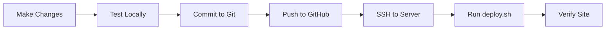

# AniFight Production Deployment - Quick Summary

## 📦 What Was Created

Your project now has complete production deployment documentation:

### Documentation Files
1. **[DEPLOYMENT_GUIDE_PRODUCTION.md](DEPLOYMENT_GUIDE_PRODUCTION.md)** - 400+ line comprehensive guide
   - Ubuntu 20.04 LTS server setup
   - Step-by-step installation of all dependencies
   - Database configuration and migrations
   - Nginx + SSL setup
   - Systemd service configuration
   - Troubleshooting guide

2. **[DEPLOYMENT_CHECKLIST.md](DEPLOYMENT_CHECKLIST.md)** - Interactive checklist
   - 30-step deployment checklist with checkboxes
   - Pre-deployment verification
   - Post-deployment testing
   - Easy to follow, hard to miss steps

3. **[GIT_WORKFLOW.md](GIT_WORKFLOW.md)** - Git best practices
   - How to push code to GitHub
   - Development workflow
   - Deployment from Git
   - Rollback procedures
   - Branch strategies

### Configuration Files
4. **[backend/.env.production](backend/.env.production)** - Production environment template
   - All required variables documented
   - Security notes and warnings
   - Instructions for generating secret keys
   - Domain: questiz.com

5. **[frontend/.env.production](frontend/.env.production)** - Frontend production config
   - API URL configuration
   - Google OAuth setup
   - Production-ready defaults

### Scripts
6. **[deploy.sh](deploy.sh)** - Automated deployment script
   - One-command deployment
   - Pulls latest code from Git
   - Updates backend and frontend
   - Runs migrations
   - Restarts services
   - Verifies deployment

---

## 🚀 Quick Start - Deploy in 3 Steps

### Step 1: Initial Deployment
```bash
# Follow the comprehensive guide
open DEPLOYMENT_GUIDE_PRODUCTION.md

# Or use the checklist
open DEPLOYMENT_CHECKLIST.md
```

**Time estimate:** 1-2 hours for first deployment

### Step 2: Update Deployment (After First Setup)
```bash
# SSH into server
ssh anifight@your_server_ip

# Run deployment script
cd /home/anifight/apps/AniFight
./deploy.sh
```

**Time estimate:** 2-5 minutes per update

### Step 3: Verify
```bash
# Visit your website
open https://questiz.com

# Check logs
sudo journalctl -u anifight-daphne -f
```

---

## 🎯 Your Domain Configuration

### Domain: **questiz.com**

#### DNS Setup Required:
```
Type: A
Name: @
Value: your_server_ip_address
TTL: 3600

Type: A
Name: www
Value: your_server_ip_address
TTL: 3600
```

#### SSL Certificate:
```bash
sudo certbot --nginx -d questiz.com -d www.questiz.com
```

#### Environment Variables:
- **Backend:** `ALLOWED_HOSTS=questiz.com,www.questiz.com`
- **Frontend:** `VITE_API_URL=https://questiz.com`
- **CORS:** `CORS_ALLOWED_ORIGINS=https://questiz.com,https://www.questiz.com`

---

## 📋 Pre-Deployment Requirements

### Before You Start:

1. **Server Access**
   - [ ] Ubuntu 20.04 LTS server ready
   - [ ] Root or sudo access
   - [ ] SSH connection working

2. **Domain Setup**
   - [ ] Domain purchased (questiz.com)
   - [ ] DNS A records configured
   - [ ] Pointing to server IP

3. **GitHub Repository**
   - [ ] Code pushed to GitHub
   - [ ] Repository accessible
   - [ ] `.gitignore` configured

4. **Google OAuth (Optional)**
   - [ ] Google Cloud Console account
   - [ ] OAuth credentials created
   - [ ] Redirect URIs configured

5. **Passwords Ready**
   - [ ] Database password chosen
   - [ ] Django secret key generated
   - [ ] Superuser password chosen

---

## 🔧 Critical Configuration Points

### 1. Database Setup
**Must be done before migrations:**
```sql
CREATE DATABASE anifight_production;
CREATE USER anifight_user WITH PASSWORD 'STRONG_PASSWORD_HERE';
GRANT ALL PRIVILEGES ON DATABASE anifight_production TO anifight_user;
```

### 2. Environment Variables
**Backend `.env` (most common issues):**
```bash
SECRET_KEY=generate-new-one-for-production
DEBUG=False  # ← MUST be False
DB_PASSWORD=match-your-postgres-password
ALLOWED_HOSTS=questiz.com,www.questiz.com  # ← No http:// or https://
CORS_ALLOWED_ORIGINS=https://questiz.com,https://www.questiz.com  # ← With https://
```

**Frontend `.env`:**
```bash
VITE_API_URL=https://questiz.com  # ← Must match your domain
VITE_GOOGLE_CLIENT_ID=your-client-id
```

### 3. Database Migrations
**Run in this exact order:**
```bash
source venv/bin/activate
python manage.py migrate  # ← Do this BEFORE starting server
python manage.py createsuperuser
python manage.py collectstatic --noinput
```

### 4. Nginx Configuration
**Key points:**
- Frontend: Serves from `/home/anifight/apps/AniFight/frontend/dist`
- Backend API: Proxies to `http://127.0.0.1:8000/api/`
- WebSocket: Proxies to `http://127.0.0.1:8000/ws/`
- Static files: From `/home/anifight/apps/AniFight/backend/staticfiles/`

---

## 🔄 Update Workflow

### Local Development → Production



### Commands:
```bash
# Local (your computer)
git add .
git commit -m "Add new feature"
git push origin main

# Server
ssh anifight@your_server_ip
cd /home/anifight/apps/AniFight
git pull origin main
./deploy.sh
```

---

## ⚠️ Common Issues & Solutions

### Issue 1: Database Migration Fails
**Error:** `relation "game_anime" does not exist`

**Solution:**
```bash
cd /home/anifight/apps/AniFight/backend
source venv/bin/activate
python manage.py showmigrations  # Check status
python manage.py migrate  # Run migrations
```

### Issue 2: 502 Bad Gateway
**Error:** Nginx shows 502 error

**Solution:**
```bash
# Check if Daphne is running
sudo systemctl status anifight-daphne

# Check logs
sudo journalctl -u anifight-daphne -n 50

# Restart service
sudo systemctl restart anifight-daphne
```

### Issue 3: Static Files Not Loading
**Error:** CSS/JS files return 404

**Solution:**
```bash
cd /home/anifight/apps/AniFight/backend
source venv/bin/activate
python manage.py collectstatic --noinput
sudo systemctl restart nginx
```

### Issue 4: CORS Errors in Browser
**Error:** `CORS policy: No 'Access-Control-Allow-Origin' header`

**Solution:**
```bash
# Edit backend/.env
nano /home/anifight/apps/AniFight/backend/.env

# Verify this line (note the https://):
CORS_ALLOWED_ORIGINS=https://questiz.com,https://www.questiz.com

# Restart backend
sudo systemctl restart anifight-daphne
```

### Issue 5: WebSocket Connection Failed
**Error:** `WebSocket connection to 'wss://questiz.com/ws/game/XXX/' failed`

**Solution:**
```bash
# 1. Check Redis is running
sudo systemctl status redis-server

# 2. Check Daphne logs
sudo journalctl -u anifight-daphne -f

# 3. Verify Nginx WebSocket config
sudo nginx -t
sudo systemctl reload nginx
```

---

## 📊 Service Architecture

```
Internet
    ↓
Nginx :80, :443 (SSL)
    ├── Frontend (/) → /home/anifight/apps/AniFight/frontend/dist
    ├── API (/api/) → Daphne :8000
    ├── WebSocket (/ws/) → Daphne :8000
    └── Static (/static/) → /backend/staticfiles/

Daphne :8000 (ASGI Server)
    ├── Django REST API
    ├── WebSocket (Channels)
    └── Admin Panel
        ↓
PostgreSQL :5432
Redis :6379
```

---

## 📝 Maintenance Schedule

### Daily
- [ ] Check site is accessible
- [ ] Monitor error logs

### Weekly
- [ ] Review system resources (disk space, memory)
- [ ] Check backup files
- [ ] Update packages if needed

### Monthly
- [ ] Review and rotate logs
- [ ] Security updates
- [ ] Performance optimization

### Commands:
```bash
# Check disk space
df -h

# View logs
sudo journalctl -u anifight-daphne --since "1 hour ago"

# Check backups
ls -lah /home/anifight/backups/

# Update packages
sudo apt update && sudo apt upgrade -y
```

---

## 🆘 Emergency Procedures

### Rollback to Previous Version
```bash
cd /home/anifight/apps/AniFight
git log --oneline -5  # Find previous commit
git reset --hard COMMIT_HASH
./deploy.sh
```

### Restore Database Backup
```bash
# Stop backend
sudo systemctl stop anifight-daphne

# Restore
psql -U anifight_user -h localhost anifight_production < /home/anifight/backups/backup_file.sql

# Start backend
sudo systemctl start anifight-daphne
```

### Full Service Restart
```bash
sudo systemctl restart postgresql
sudo systemctl restart redis-server
sudo systemctl restart anifight-daphne
sudo systemctl restart nginx
```

---

## 📚 File Reference

### Must Edit Before Deployment
1. `backend/.env` - Copy from `.env.production` and customize
2. `frontend/.env` - Copy from `.env.production` and customize
3. `/etc/nginx/sites-available/questiz.com` - Nginx configuration
4. `/etc/systemd/system/anifight-daphne.service` - Systemd service

### Documentation to Read
1. [DEPLOYMENT_GUIDE_PRODUCTION.md](DEPLOYMENT_GUIDE_PRODUCTION.md) - Main guide (read first)
2. [DEPLOYMENT_CHECKLIST.md](DEPLOYMENT_CHECKLIST.md) - Follow step-by-step
3. [GIT_WORKFLOW.md](GIT_WORKFLOW.md) - For updates and Git operations

### Scripts to Use
1. `deploy.sh` - Main deployment script (chmod +x first)
2. `backup_db.sh` - Database backup (create from guide)
3. `check_services.sh` - Service status checker (create from guide)

---

## ✅ Success Criteria

Your deployment is successful when:

- [ ] https://questiz.com loads without SSL warnings
- [ ] Can register a new account
- [ ] Can log in with Google OAuth
- [ ] Can create a single-player game
- [ ] Can create a multiplayer room
- [ ] Can join multiplayer room from another browser
- [ ] WebSocket connection works (check browser console - no errors)
- [ ] Django admin accessible at https://questiz.com/admin/
- [ ] All services running: `sudo systemctl status anifight-daphne nginx postgresql redis-server`
- [ ] No errors in logs: `sudo journalctl -u anifight-daphne -n 50`

---

## 🎓 Learning Resources

- **Django Deployment:** https://docs.djangoproject.com/en/4.2/howto/deployment/
- **Nginx:** https://nginx.org/en/docs/
- **Let's Encrypt:** https://letsencrypt.org/docs/
- **PostgreSQL:** https://www.postgresql.org/docs/15/
- **Django Channels:** https://channels.readthedocs.io/

---

## 📞 Next Steps

1. **First Time Deployment:**
   - Read [DEPLOYMENT_GUIDE_PRODUCTION.md](DEPLOYMENT_GUIDE_PRODUCTION.md)
   - Follow [DEPLOYMENT_CHECKLIST.md](DEPLOYMENT_CHECKLIST.md)
   - Time estimate: 1-2 hours

2. **Subsequent Updates:**
   - Read [GIT_WORKFLOW.md](GIT_WORKFLOW.md)
   - Use `deploy.sh` script
   - Time estimate: 2-5 minutes

3. **Troubleshooting:**
   - Check logs: `sudo journalctl -u anifight-daphne -f`
   - See "Common Issues" section above
   - Refer to [debug_websocket.md](debug_websocket.md) for WebSocket issues

---

**Good luck with your deployment! 🚀**

Remember: Take your time, read the documentation carefully, and test each step. The guides are comprehensive and designed for beginners.
